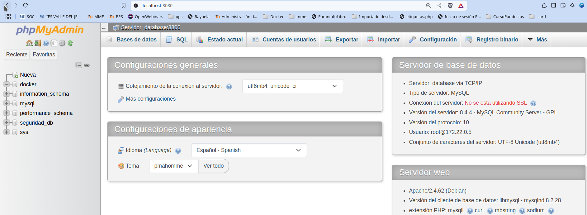
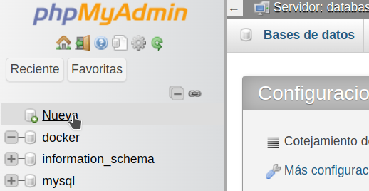
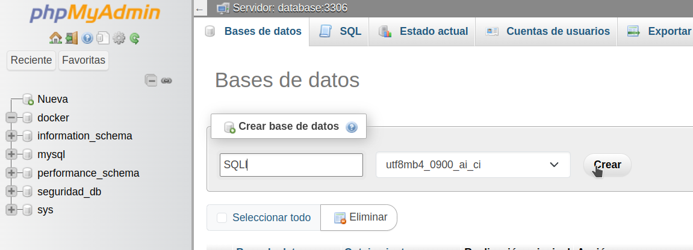

#PPS-Unidad3Actividad2-InyeccionSQL
Explotación y Mitigación de SQL Injection (SQLi)

Tenemos como objetivo:

> Recordar cómo se pueden hacer ataques de inyección de SQL
>
> Analizar el código de la aplicación que permite inyección SQL
>
> Implementar diferentes modificaciones del codigo para aplicar mitigaciones o soluciones.

---
## ACTIVIDADES A REALIZAR
> Lee el siguiente [documento sobre Explotación y Mitigación de ataques de Inyección SQL](files/ExplotacionYMitigacionSQLInjection.pdf) de Raúl Fuentes. Nos va a seguir de guía para aprender a explotar y mitigar ataques de inyección SQL en nuestro entorno de pruebas.
Vamos realizando operaciones:
### Iniciar entorno de pruebas
-Inicia el entorno de pruebas de nuestro servidor LAMP: `docker-compose up -v`

### Creación de base de datos
Para crear la Base de datos que vamos a utilizar para esta actividad tenemos varias opciones:

**OPCIÓN 1: De manera gráfica**
- Accedemos via web al servicio de phpmyadmin que tenemos instalado: <http://localhost:8080>

- Creamos una base de datos nueva, pulsando el botón de _Nueva_

---	
## ENTREGA

>__Realiza las operaciones indicadas__

>__Crea un repositorio  con nombre PPS-Unidad3Actividad3-Tu-Nombre donde documentes la realización de ellos.__

> No te olvides de documentarlo convenientemente con explicaciones, capturas de pantalla, etc.

>__Sube a la plataforma, tanto el repositorio comprimido como la dirección https a tu repositorio de Github.__
